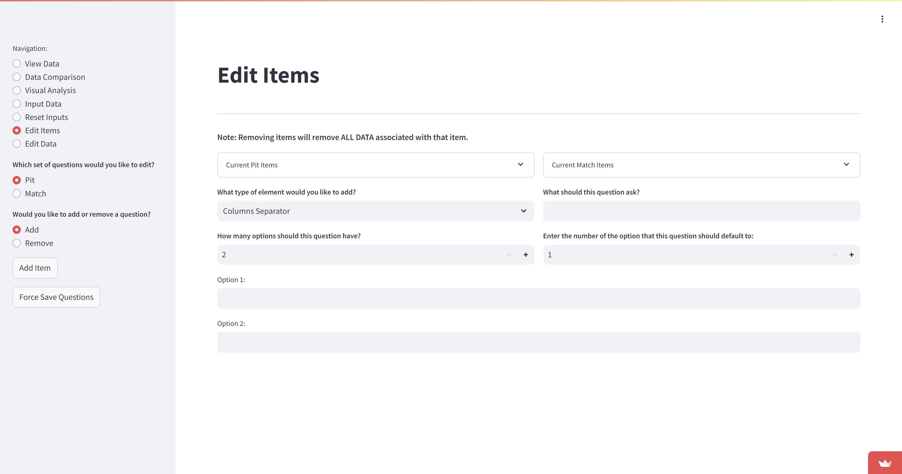

# Test cases definition round 1

Create a header item

Create a columns separator item

Create a Columns item

Create a Selection Box item

Create a multiple choice item

Create a number input item

Create a text input item

Everything except for header has a set of 3 mandatory fields and a variable number of option fields.  The fields are:

1. What should this question ask?
2. How many options should this question have?
3. Enter the number of the option that this question should default to
4. Options (Option 1, Option 2, etc)

I observe that there are no explicit quality targets to test against, no AC or anything.  This means that quality targets need to be specified as a set of assumptions.

Screencap:

# Quality Target Assumptions

## 1. Functionality

- All item types (header, columns separator, columns, selection box, multiple choice, number input, text input) can be created successfully
- Mandatory fields for each item type are enforced and cannot be left blank
- Optional fields can be left blank without causing errors
- The number of options specified matches the actual number of options that can be entered

## 2. User Interface

- The interface is intuitive and easy to navigate
- All buttons, input fields, and dropdown menus are clearly labeled and functional
- The layout is responsive and works well on different screen sizes

## 3. Data Validation

- Input fields accept only appropriate data types (e.g., numbers for "number input" items)
- Error messages are displayed for invalid inputs
- The default option number is within the range of available options

## 4. Performance

- The app responds quickly to user interactions (less than 2 seconds for most operations)
- Large numbers of items can be created without significant performance degradation

## 5. Compatibility

- The app functions correctly on major web browsers (Chrome, Firefox, Safari, Edge)
- The app works on both desktop and mobile devices

## 6. Data Persistence

- Created items are saved and can be retrieved after closing and reopening the app
- Changes to existing items are properly saved

## 7. Accessibility

- The app is navigable using keyboard controls
- Color contrast meets WCAG 2.1 AA standards
- Screen readers can interpret the interface correctly

## 8. Security

- User inputs are sanitized to prevent XSS attacks
- Sensitive data (if any) is properly encrypted

These assumptions provide a framework for comprehensive testing of the scouting extreme app's edit items functionality. They cover various aspects of software quality and can be used to develop specific test cases and scenarios.

# Test cases definition round 2

Create a header item, “abc” as text. Expect a “abc” header item to be added to the bottom of the list.

Finding: Test completed, results as expected.

Create a header item, “” as text. Expect a blank header item to be added to the bottom of the list.

Finding: The second blank header was inserted in the wrong order.
//2

Test: Switch to Remove Items, remove the blank header.  Expectation: the header will be present to be removed.

Finding: the blank header is not present to be removed.
//3

Test: Add a column separator, fill out the fields “normally”.  Expectation: to be able to see this information reflected somewhere in the app.

Evidence: a test columns separator was added.
//4

Finding: I can’t see the test columns separator in the View Data screen.
//5

# Level set

I’ve run a number of tests and I feel like the intended happy path through the app is not obvious to follow.  I also feel like the app doesn’t handle deviation from the happy path very well.  For instance, if column separators aren’t supposed to have options and defaults, then those fields should probably not be provided for data entry.  Maybe they can be hidden, or maybe they can be greyed out.  An application that deviates too far from user expectations will cause frustration and app abandonment behaviours by users (e.g. using a spreadsheet “because its easier”).

Recommendations:

1. Set better expectations for users and collaborators.  
    1. Consider creating a manual on how to use the app.  This manual may need to “grow” along side the evolving code.  Keep the documentation light, which will make it easier to change than heavier, more comprehensive documentation.  This could be a markdown file in the repo.  Suggested names: “User Manual” or “Readme”.
    2. Consider describing high level expected app behaviour.  This document is “dev team facing” rather than “user facing”; it provides a reference document for the dev team (which can be a single person, or can be multiple people) to use as a guide to clarify and challenge.  This could be a markdown file in the repo.  Suggested names: “Product definition” or “Application design and quality definition”.
2. Define a set of concerns that testing should focus on.
    1. I expect the top concern is “the app should be ready for use during competition.” Other concerns might be “the app protects the user from inadvertently deleting all data or taking other catastrophic action”, or “the app should be secured against standard attacks.”
    2. A brainstorming session can generate and then winnow down a set of realistic concerns, stacked from the item of greatest concern to the item of least concern. Subsequent conversation can discover strategies to code and test the app while paying attention to addressing the concern.
    3. The item of greatest concern would (probably) be further decomposed into quality targets.  Example assumptions of quality targets are provided above.

# Overview of Software Testing

Software testing is a critical process in software development that involves evaluating and verifying that a software product or application does what it is supposed to do. The main purpose of testing is to identify errors, gaps, or missing requirements in contrast to actual requirements.

## Types of Software Testing

- **Functional Testing:** Verifies that each function of the software application operates in conformance with the requirement specification.
- **Non-Functional Testing:** Includes performance testing, load testing, stress testing, and usability testing.
- **Unit Testing:** Testing individual components or modules of a software.
- **Integration Testing:** Testing the interfaces between components, interactions to different parts of the system, or interaction with other systems.
- **System Testing:** Testing a completely integrated system to verify that it meets specified requirements.
- **Acceptance Testing:** Formal testing conducted to determine whether a system satisfies the acceptance criteria.

## Testing Approaches

- **Manual Testing:** Executed by a human tester without the use of automation tools.
- **Automated Testing:** Uses special software to control the execution of tests and compares actual outcomes with predicted outcomes.

## Testing Levels

- **White Box Testing:** Testing based on an analysis of internal workings and structure of a piece of software.
- **Black Box Testing:** Testing without knowledge of the internal workings of the item being tested.
- **Grey Box Testing:** Combination of White Box and Black Box Testing.

## Testing Process

1. Test Planning
2. Test Case Development
3. Test Environment Setup
4. Test Execution
5. Test Reporting
6. Defect Tracking

Effective software testing helps ensure the quality, reliability, and performance of software applications, ultimately leading to improved user satisfaction and reduced maintenance costs.

# Session-Based Exploratory Testing (SBET)

Session-Based Exploratory Testing (SBET) is a structured approach to exploratory testing that combines the benefits of exploratory testing with a more systematic and documented process.

## Key Characteristics of SBET:

- **Time-boxed sessions:** Testing is conducted in focused, uninterrupted sessions, typically lasting 60-120 minutes.
- **Charter-guided:** Each session has a specific mission or charter that guides the tester's focus.
- **Exploratory nature:** Testers have the freedom to investigate and explore the software based on their observations and intuitions.
- **Structured reporting:** Results are documented in session reports, providing accountability and traceability.

## SBET Process:

1. **Planning:** Define session charters and allocate resources.
2. **Execution:** Conduct time-boxed testing sessions following the charter.
3. **Debriefing:** Review session results and discuss findings with stakeholders.
4. **Reporting:** Document discoveries, issues, and coverage in structured session reports.

## Benefits of SBET:

- Combines the flexibility of exploratory testing with the structure of scripted testing.
- Improves test coverage and defect detection.
- Provides better visibility into the testing process.
- Enhances tester skills and product knowledge.

SBET is particularly effective for complex systems, new features, or areas where traditional scripted testing may miss important issues. It allows for rapid feedback and adapts well to changing project requirements.